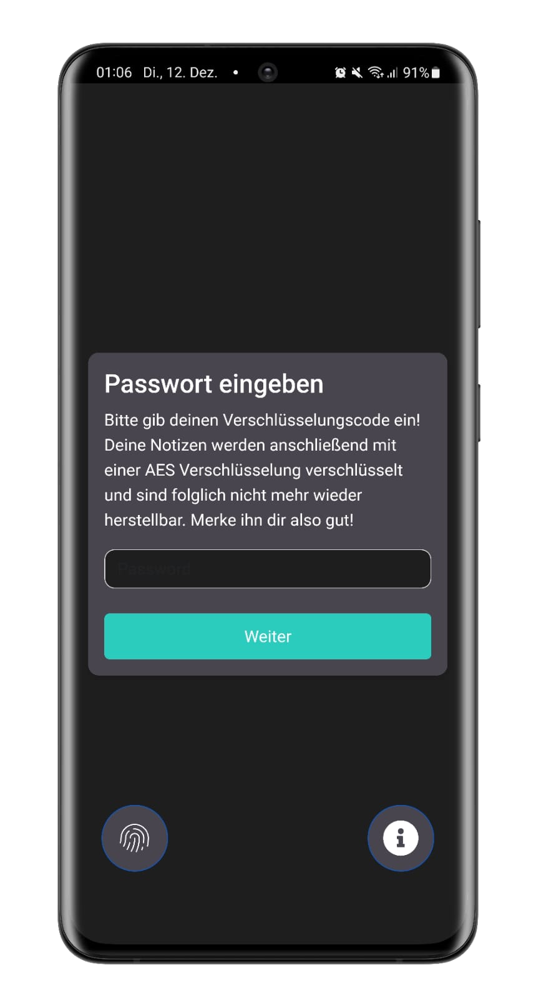
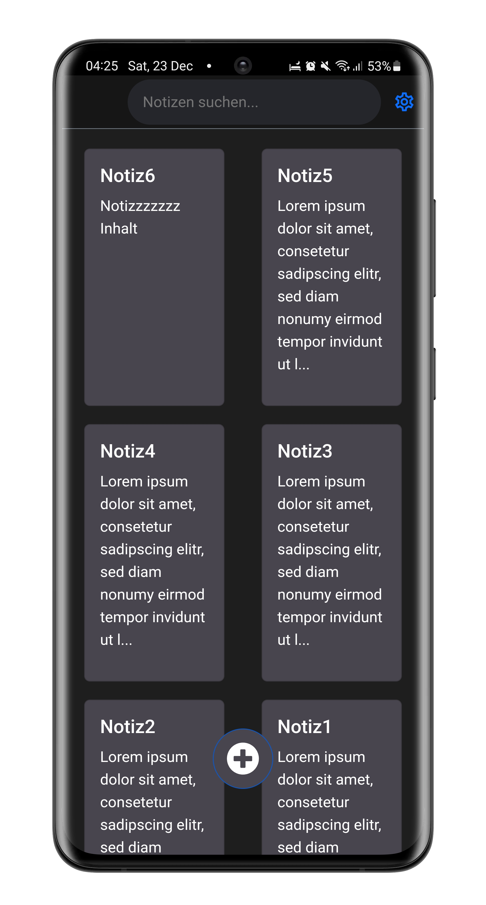
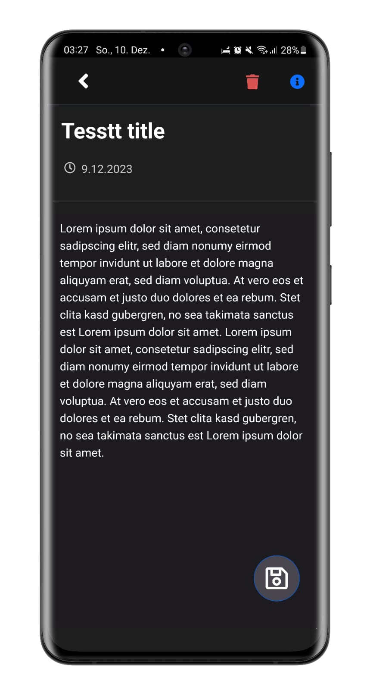
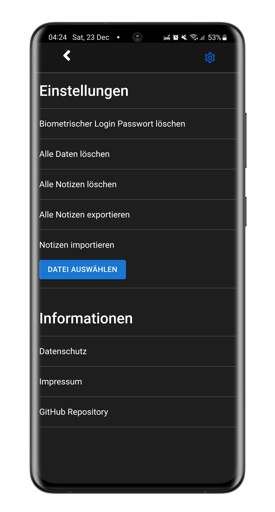
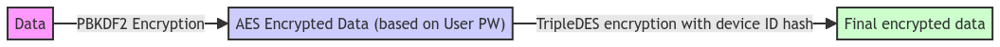
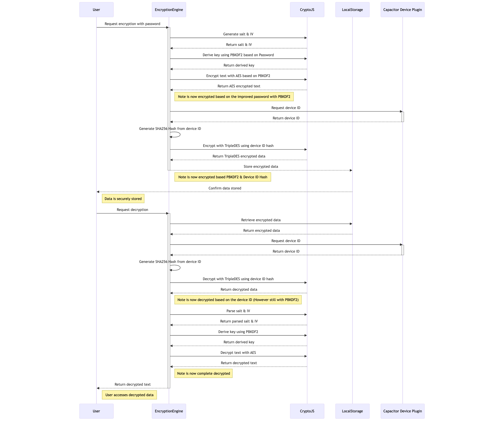
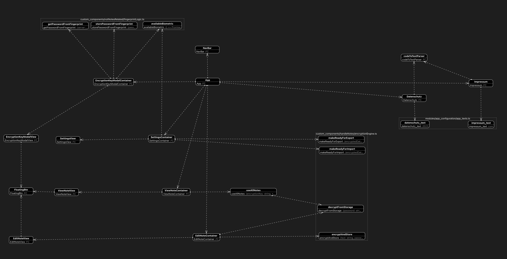

# LocalNotes

Last Edit: 02.2024 <br>
Language: Typescript React Capacitor<br>

With this app, it is possible to securely store notes locally with AES & Triple DES encryption, edit/delete them and search them.
It is also possible to decrypt the notes using native biometrics (e.g. fingerprint sensor). (More on this under Security)

Google Play Store: https://play.google.com/store/apps/details?id=de.scheub.localNotes
<br />
Apple App Store: https://apps.apple.com/de/app/local-notes/id6474680128
<br><br><br>

Deutsche Kurzbeschreibung:
Mit dieser App ist es möglich Notizen mit AES-Verschlüsselung & TripleDES sicher lokal zu speichern, sie zu bearbeiten/löschen und sie zu durchsuchen.
Zudem ist es möglich mithilfe der Native Biometric (z.B. Fingerabdruck Sensor) die Notizen zu entschlüsseln. (Mehr dazu unter Security)

| Start Screen | Notes Overview | Note Edit | Settings |
|--------------|----------------|-----------|-----------|
|  |  |  |  |

## Security
First of all: All notes are stored encrypted with AES256. 

- The user's password is first hashed using PBKDF2 with 60,001 iterations and a fixed salt.
- This hash is then passed through 2,000 iterations using PBKDF2 with a different salt for each note. 
- The resulting hash is then used for AES256 encryption.
- In addition, the data is encrypted with a SHA256 hash based on the device ID using TripleDES.
- No data is transferred to a cloud or similar. 
- All data is processed and stored locally on the device.


### Justification
- Why is PBKDF2 performed twice? 
  - So that it is possible to use a different salt for each note. This increases the protection against rainbow table attacks.
  - In addition, the recommended number of iterations for PBKDF2 can still be carried out without extremely poor performance. This increases protection against Brutal Force Attacks.
  - Such a high number of iterations in combination with different salts for each note has proven to be very slow and impractical on current devices (e.g. iPhone 14).
  - Furthermore, if a single note is decrypted, the others are not threatened.

- Why just use SHA256 for the PBKDF2?
  - Quick answer, simply because of the performance. 
  - With a SHA512 hash for the login, a current Android flagship smartphone (from 2023) took an average of 50 seconds and a current iPhone around 15 seconds. 
  - Since the performance with SHA256 is significantly better with Android around 10 seconds and iPhone 2-3 seconds, this was used.

- Why AES and TripleDES?
  - AES256 is currently the general recommendation. And since the goal was to use an additional encryption with a different password (here the deviceID), it was the right opportunity to use a different method.
  - So if AES256 or TripleDES have security problems, this can work as a further protection measure. 
  - It also increases the effort for attackers as they have to decrypt two different methods.
  - Since it also offers no disadvantages (except performance), e.g. a hack of the TripleDES encryption still leads to the AES encryption having to be decrypted, the advantages were seen to outweigh the disadvantages. 


<br />

### Encryption Engine Flow

The encryption and decryption process is also shown here. 
The password is already understood to be the PBKDF2 processed hash with 60,001 iterations, as only this is used within the application as soon as it has been generated after opening the app.

Anyone interested is free to take a closer look at this and make suggestions for improvement. The entire encryption/decryption logic takes place in the EncryptionEngine. (Except the logic of the biometric login)

<br /><br /><br />

### Security Fingerprint Login
- The password is stored in the KeyStore on Android and in the keychain on iOS if biometric authentication is enabled. These stores are secure according to the OS publisher. 
If this is not used, the password is not saved either.
- Only the first PBKDF2 hash from the first derivation is used. No password in plain text or similar. This is also the reason for the significantly faster login with a biometric login.
- The password hash is encrypted with TripleDES as it does not usually need to be decrypted frequently.
- The password hash is encrypted with a SHA256 hash from the deviceID/identifier of the device provided by Capacitor before it is stored. (Just to be safe and independent of OS security.)

    <i>On iOS, the identifier is a UUID that uniquely identifies a device to the app’s vendor ([read more](https://developer.apple.com/documentation/uikit/uidevice/1620059-identifierforvendor)).
     
    On Android 8+, __the identifier is a 64-bit number (expressed as a hexadecimal string)__, unique to each combination of app-signing key, user, and device ([read more](https://developer.android.com/reference/android/provider/Settings.Secure#ANDROID_ID)).</i>

### Security Export/Import
- When the notes are exported, they are no longer encrypted with the SHA256 hash of the DeviceID. However, they are encrypted using AES with a specific word which is hard-coded here.

- As before, the notes are also encrypted with PBKDF2 and should only be decryptable with the user's password. 

- When importing the data, the data must be decrypted with the user's password, otherwise it should not be visible.

### Note on the security measures
- The secure encryption of data/notes cannot be guaranteed. 
- The application has been developed to be as secure as possible from the developer's point of view. 
- It is open to anyone to review the security measures here and report any security vulnerabilities identified here. (This is why the application is open source)
- The Crypto-JS node package is used for encryption. If this has security gaps or similar, the data here is insecure!

## Distribution
- Android/iOS: The app is distributed in the Google Play Store and Apple App Store with the help of Capacitor.
- Windows: With the help of Electron, it is distributed in the Microsoft App Store as MSI. Installation. (Without support for Windows Hello/fingerprint scanner)
- Mac: It is possible to use the Electron app from the repo. However, it is recommended to simply download the iOS app from the Apple App Store for M1 MacBooks. This app also supports Touch ID etc. directly.

## Testing
The Jest testing framework is used for testing.
The tests here are always written in Typescript. 

Under modules are modules from other projects of mine for which I have not written further tests.

The goal is actually to have about 80% test coverage. This number appears to be enough as this is a freetime project.


File                  | % Stmts | % Branch | % Funcs | % Lines | Uncovered Line #s 
----------------------|---------|----------|---------|---------|-------------------
All files             |   86.86 |     60.9 |   88.88 |   86.92 |                   
 src                  |     100 |      100 |     100 |     100 |                   
  App.tsx             |     100 |      100 |     100 |     100 |                   
  i18n.ts             |     100 |      100 |     100 |     100 |                   
  index.tsx           |     100 |      100 |     100 |     100 |                   
 ...nents/handleNotes |      90 |      100 |   85.71 |      90 |                   
  encryptionEngine.ts |      90 |      100 |   85.71 |      90 | 23-30             
 ...dleNotes/editNote |     100 |       50 |     100 |     100 |                   
  ...ner-editNote.tsx |     100 |       50 |     100 |     100 | 20-44             
  screen-editNote.tsx |     100 |      100 |     100 |     100 |                   
 ...dleNotes/viewNote |   95.55 |       70 |     100 |   95.23 |                   
  ...ner-viewNote.tsx |     100 |      100 |     100 |     100 |                   
  getNotes.ts         |   96.29 |    66.66 |     100 |      96 | 19                
  screen-viewNote.tsx |   88.88 |       75 |     100 |    87.5 | 24                
 ...s/notNotesRelated |   97.67 |    92.85 |     100 |   97.67 |                   
  fingerprintLogic.ts |   97.67 |    92.85 |     100 |   97.67 | 60                
 .../encryption_modal |     100 |      100 |     100 |     100 |                   
  ...yption-modal.tsx |     100 |      100 |     100 |     100 |                   
  ...yption-modal.tsx |     100 |      100 |     100 |     100 |                   
 ...tesRelated/navBar |   84.61 |       60 |   85.71 |   84.61 |                   
  ...ainer-navBar.tsx |   83.33 |    54.54 |   83.33 |   83.33 | 25,44-46          
  screen-navBar.tsx   |     100 |       75 |     100 |     100 | 59                
 ...sRelated/settings |   64.03 |    28.94 |   63.63 |   64.28 |                   
  ...ner_settings.tsx |   60.57 |    16.66 |      50 |   60.78 | ...59-175,181-193 
  screen_settings.tsx |     100 |       75 |     100 |     100 | 44-56             
 ...app_configuration |     100 |      100 |     100 |     100 |                   
  app_texts.ts        |     100 |      100 |     100 |     100 |                   
 src/modules/legal    |     100 |    71.42 |     100 |     100 |                   
  ...ToTextParser.tsx |     100 |      100 |     100 |     100 |                   
  datenschutz.tsx     |     100 |       50 |     100 |     100 | 21-33             
  impressum.tsx       |     100 |       50 |     100 |     100 | 19-31             
 ...es/legal/usedLibs |     100 |      100 |     100 |     100 |                   
  ..._usedLibList.tsx |     100 |      100 |     100 |     100 |                   
  ..._usedLibList.tsx |     100 |      100 |     100 |     100 |                   
 src/modules/ui       |     100 |      100 |     100 |     100 |                   
  floatingBtn.tsx     |     100 |      100 |     100 |     100 |               
     


## Architecture
The components used are divided into two categories:
- `custom_components`: Components which I only use in this project. These are on the left and in the middle of the architecture diagram.
- `modules`: Components/functions that I also use in other projects, which are therefore kept generic. (Possibly, however, slightly adapted e.g. the colors here)  These components can be seen on the right of the architecture diagram. (Except for the floating button which is left)

As a result of the use from the modules, there is also one configuration file:
- `app_texts`: Contains texts such as the description, imprint text, data protection text etc.


Note: The cookie banner and footer text are already present here as they may be used in the future for the web version.

## Troubleshooting

### While generate Electron App for Windows/Mac/LNX

```
node_modules/builder-util-runtime/out/httpExecutor.d.ts:9:5 - error TS2411: Property '"accept-charset"' of type 'string | string[]' is not assignable to 'string' index type 'string'.

9     [key: string]: string;
      ~~~~~~~~~~~~~~~~~~~~~~
```

For whatever reason, this NPM module is not 100% compatible. The easy fix is to simply change the location in the error so that the file type matches.
Just adjust the module inside the Electron folder under node_modules by adjust the line:
```
export interface RequestHeaders extends OutgoingHttpHeaders {
    [key: string]: string | string[]|number | undefined;
}
```

is adapted to this:
export interface RequestHeaders extends OutgoingHttpHeaders {
    [key: string]: string | string[];
}


## Available Scripts

In the project directory, you can run:

### `npm start`

Runs the app in the development mode.\
Open [http://localhost:3000](http://localhost:3000) to view it in the browser.

The page will reload if you make edits.\
You will also see any lint errors in the console.

### `npm test`

Launches the test runner in the interactive watch mode.\
See the section about [running tests](https://facebook.github.io/create-react-app/docs/running-tests) for more information.

### `npm test -- --coverage --watchAll`

Returns the complete test coverage rate in the form of a table for all files.


### `npm run build`

Builds the app for production to the `build` folder.\
It correctly bundles React in production mode and optimizes the build for the best performance.

The build is minified and the filenames include the hashes.\
Your app is ready to be deployed!

See the section about [deployment](https://facebook.github.io/create-react-app/docs/deployment) for more information.

### `npm run eject`

**Note: this is a one-way operation. Once you `eject`, you can’t go back!**

If you aren’t satisfied with the build tool and configuration choices, you can `eject` at any time. This command will remove the single build dependency from your project.

Instead, it will copy all the configuration files and the transitive dependencies (webpack, Babel, ESLint, etc) right into your project so you have full control over them. All of the commands except `eject` will still work, but they will point to the copied scripts so you can tweak them. At this point you’re on your own.

You don’t have to ever use `eject`. The curated feature set is suitable for small and middle deployments, and you shouldn’t feel obligated to use this feature. However we understand that this tool wouldn’t be useful if you couldn’t customize it when you are ready for it.


## Used NPM Modules
According to the command npm list
You can see the deeper NPM modules used and which of these are used in the licenses.json.

├── @babel/core@7.23.9

├── @babel/plugin-proposal-private-property-in-object@7.21.11

├── @babel/preset-env@7.23.9

├── @capacitor-community/electron@5.0.1

├── @capacitor/android@5.7.0

├── @capacitor/app@5.0.7

├── @capacitor/cli@5.7.0

├── @capacitor/core@5.7.0

├── @capacitor/device@5.0.7

├── @capacitor/filesystem@5.2.1

├── @capacitor/ios@5.7.0

├── @capacitor/share@5.0.7

├── @emotion/react@11.11.3

├── @emotion/styled@11.11.0

├── @mui/material@5.15.7

├── @testing-library/jest-dom@5.17.0

├── @testing-library/react@13.4.0

├── @testing-library/user-event@13.5.0

├── @types/crypto-js@4.2.2

├── @types/jest@27.5.2

├── @types/node@16.18.79

├── @types/react-dom@18.2.19

├── @types/react@18.2.55

├── babel-jest@29.7.0

├── bootstrap-icons@1.11.3

├── bootstrap@5.3.2

├── capacitor-native-biometric@4.2.2

├── crypto-js@4.2.0

├── electron-builder@24.9.1

├── i18next-browser-languagedetector@7.2.0

├── i18next@23.8.2

├── license-checker@25.0.1

├── react-bootstrap@2.10.0

├── react-dom@18.2.0

├── react-i18next@14.0.5

├── react-icons@4.12.0

├── react-router-dom@6.22.0

├── react-scripts@5.0.1

├── react@18.2.0

└── typescript@4.9.5