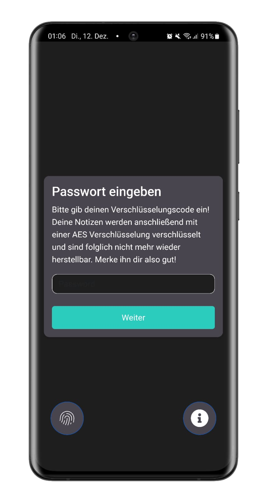
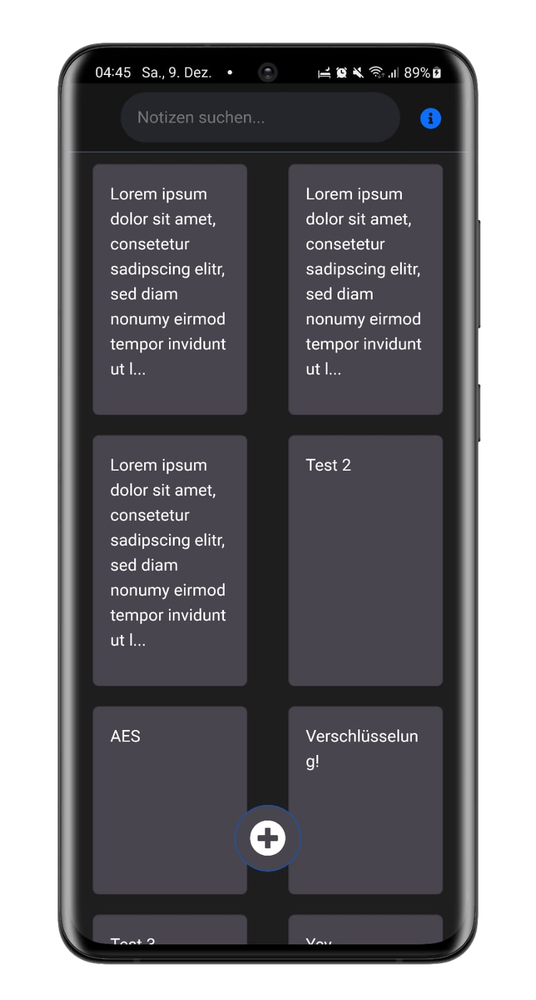
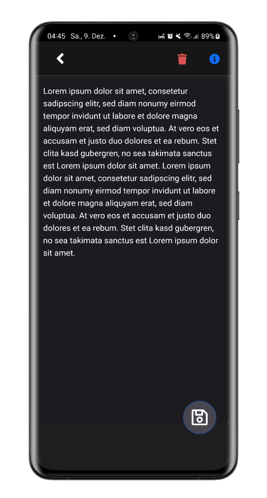

# LocalNotes

Last Edit: 12.2023  
Language: Typescript React Capacitor 

With this app, it is possible to securely store notes locally with AES encryption, edit/delete them and search them.
It is also possible to decrypt the notes using native biometrics (e.g. fingerprint sensor). (More on this under Security)

Google Play Store: https://play.google.com/store/apps/details?id=de.scheub.localNotes

   

Deutsche Kurzbeschreibung:
Mit dieser App ist es möglich Notizen mit AES-Verschlüsselung sicher lokal zu speichern, sie zu bearbeiten/löschen und sie zu durchsuchen.
Zudem ist es möglich mithilfe der Native Biometric (z.B. Fingerabdruck Sensor) die Notizen zu entschlüsseln. (Mehr dazu unter Security)

| Start Screen | Notes Overview | Note Edit |
|--------------|----------------|-----------|
|  |  |  |

## Security
- All notes are stored encrypted with AES256. 
- The key for the notes is the user's password which has been edited with PBKDF2/KDF to make it ready for AES256.
- No data is transferred to a cloud or similar. 
- All data is processed and stored locally on the device.
   
- The password is stored in the KeyStore on Android and in the keychain on iOS if biometric authentication is enabled. These stores are secure according to the OS publisher. 
If this is not used, the password is not saved either.
- The password is encrypted with TripleDES as it does not usually need to be decrypted frequently.
- The password is encrypted with a SHA256 hash from the deviceID/identifier of the device provided by Capacitor before it is stored. (Just to be safe and independent of OS security.)

    <i>On iOS, the identifier is a UUID that uniquely identifies a device to the app’s vendor ([read more](https://developer.apple.com/documentation/uikit/uidevice/1620059-identifierforvendor)).
     
    On Android 8+, __the identifier is a 64-bit number (expressed as a hexadecimal string)__, unique to each combination of app-signing key, user, and device ([read more](https://developer.android.com/reference/android/provider/Settings.Secure#ANDROID_ID)).</i>

## Testing
The Jest testing framework is used for testing.
The tests here are always written in Typescript. 

Under modules are modules from other projects of mine for which I have not written further tests.

The goal is actually to have about 90% test coverage, but due to refactorings etc. it is possible that this is temporarily lower.

File                                 | % Stmts | % Branch | % Funcs | % Lines | Uncovered Line #s 
-------------------------------------|---------|----------|---------|---------|-------------------
All files                            |   40.44 |    32.55 |   38.46 |      40 |                   
 src                                 |     100 |      100 |     100 |     100 |                   
  App.tsx                            |     100 |      100 |     100 |     100 |                   
 ...ustom_components/notNotesRelated |   38.23 |    27.58 |      50 |   38.23 |                   
  fingerprintLogic.ts                |   15.21 |        0 |   16.66 |   15.21 | 6-7,16-56,66-90   
  navBar.tsx                         |   86.36 |    66.66 |   83.33 |   86.36 | 39-44             
 ...notNotesRelated/encryption_modal |   65.38 |    66.66 |   46.15 |   65.38 |                   
  container-encryption-modal.tsx     |   60.86 |       50 |   36.36 |   60.86 | 34-53,64          
  screen-encryption-modal.tsx        |     100 |      100 |     100 |     100 |                   
 ...ponents/notNotesRelated/settings |    6.25 |        0 |       0 |    6.25 |                   
  container_settings.tsx             |    3.84 |        0 |       0 |    3.84 | 10-57             
  screen_settings.tsx                |   16.66 |        0 |       0 |   16.66 | 24-55             
 src/modules/app_configuration       |     100 |      100 |     100 |     100 |                   
  app_texts.ts                       |     100 |      100 |     100 |     100 |                   
 src/modules/legal                   |     100 |      100 |     100 |     100 |                   
  datenschutz.tsx                    |     100 |      100 |     100 |     100 |                   
  impressum.tsx                      |     100 |      100 |     100 |     100 |                   

## Architecture
The components used are divided into two categories:
- `custom_components`: Components which I only use in this project. These are on the left and in the middle of the architecture diagram.
- `modules`: Components/functions that I also use in other projects, which are therefore kept generic. (Possibly, however, slightly adapted e.g. the colors here)  These components can be seen on the right of the architecture diagram. 

As a result of the use from the modules, there is also one configuration file:
- `app_texts`: Contains texts such as the description, imprint text, data protection text etc.

Note: The cookie banner and footer text are already present here as they may be used in the future for the web version.

## Available Scripts

In the project directory, you can run:

### `npm start`

Runs the app in the development mode.\
Open [http://localhost:3000](http://localhost:3000) to view it in the browser.

The page will reload if you make edits.\
You will also see any lint errors in the console.

### `npm test`

Launches the test runner in the interactive watch mode.\
See the section about [running tests](https://facebook.github.io/create-react-app/docs/running-tests) for more information.

### `npm run build`

Builds the app for production to the `build` folder.\
It correctly bundles React in production mode and optimizes the build for the best performance.

The build is minified and the filenames include the hashes.\
Your app is ready to be deployed!

See the section about [deployment](https://facebook.github.io/create-react-app/docs/deployment) for more information.

### `npm run eject`

**Note: this is a one-way operation. Once you `eject`, you can’t go back!**

If you aren’t satisfied with the build tool and configuration choices, you can `eject` at any time. This command will remove the single build dependency from your project.

Instead, it will copy all the configuration files and the transitive dependencies (webpack, Babel, ESLint, etc) right into your project so you have full control over them. All of the commands except `eject` will still work, but they will point to the copied scripts so you can tweak them. At this point you’re on your own.

You don’t have to ever use `eject`. The curated feature set is suitable for small and middle deployments, and you shouldn’t feel obligated to use this feature. However we understand that this tool wouldn’t be useful if you couldn’t customize it when you are ready for it.
